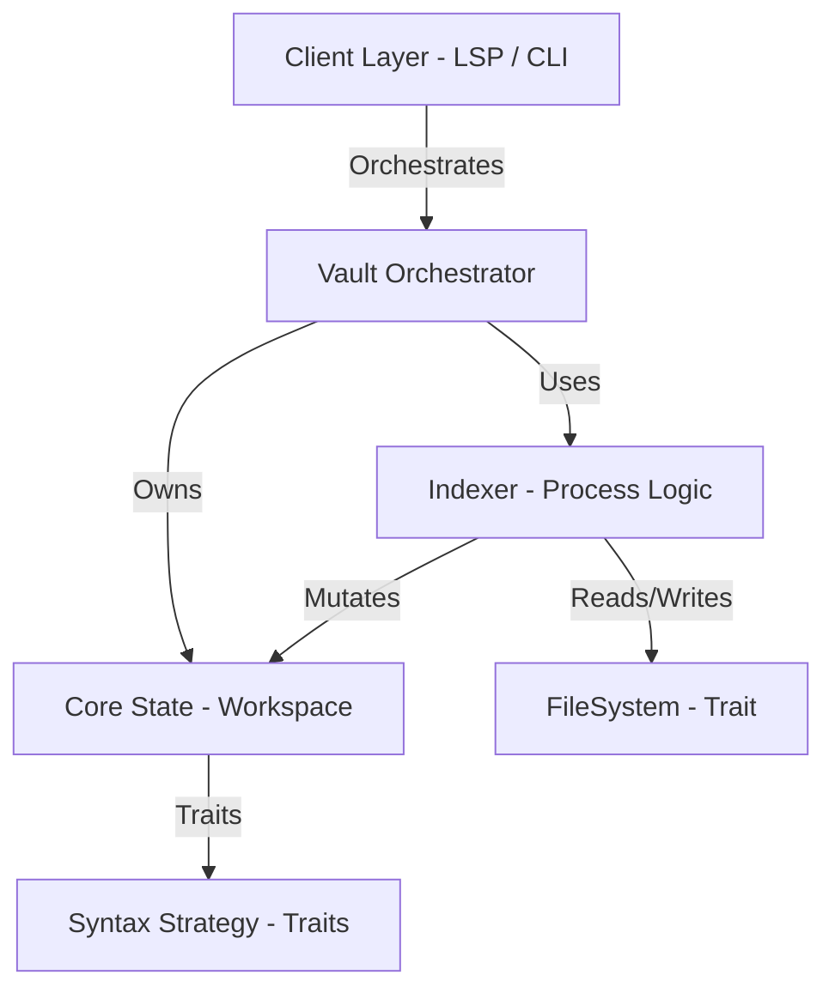

# Dendrite - System Architecture

Dendrite is designed as a headless semantic engine that powers various knowledge-management clients.

## 1. High-Level Architecture

Dendrite follows a three-layer architecture pattern:

### 1.1 Client Layer
- **LSP Backend**: Implements the Language Server Protocol.
- **Vault Handle**: Uses the `Vault` orchestrator as the primary entry point for all operations.
- **Document Cache**: Manages "dirty" buffers (unsaved changes) to provide real-time feedback.

### 1.2 Core Engine (`dendrite-core`)
- **Vault**: The top-level orchestrator that bridges `Workspace` with `FileSystem`.
- **Indexer**: Orchestrates the "Process" of indexing (scan -> parse -> assemble -> upsert).
- **Workspace**: A **pure state container** holding notes, links, and the hierarchy tree.
- **Store**: An in-memory graph database storing notes, links, and backlinks.
- **Identity Registry**: Ensures note IDs remain stable across renames.
- **Refactor Engine**: A read-only component that calculates `EditPlan` objects based on graph relationships.
 
### 1.3 Strategy Layer (Syntax Abstraction)
- **Trait-Based**: All syntax-specific behaviors (file naming, link formats, hierarchy rules) are abstracted behind the `SyntaxStrategy` trait.
- **Pluggable Design**: The core engine is syntax-agnostic; different note-taking formats are supported by implementing the `SyntaxStrategy` trait.
- **Example Strategies**:
  - **Dendron Strategy**: Dot-separated hierarchies (`foo.bar.md`), `[[alias|target]]` link format
  - **Future**: Obsidian, Logseq, or custom formats

#### SyntaxStrategy Responsibilities
A `SyntaxStrategy` implementation defines:
1. **File System Mapping**: How file paths map to Note Keys (e.g., `foo.bar.md` ↔ `"foo.bar"`)
2. **Hierarchy Rules**: How parent-child relationships are determined
3. **Link Parsing**: WikiLink format (`[[alias|target]]` vs `[[target|alias]]`)
4. **Link Generation**: How to reconstruct link text during refactoring
5. **Display Names**: How note titles are resolved and displayed

---

## 2. Communication Protocol

Dendrite communicates via **JSON-RPC 2.0**, primarily following the **LSP** specification but extending it for knowledge-specific features.

### 2.1 Standard LSP Methods
- `textDocument/definition`: Jump to note or anchor.
- `textDocument/completion`: WikiLink and block ID autocompletion.
- `workspace/didChangeWatchedFiles`: Automatic re-indexing on disk changes.

### 2.2 Custom Extensions
- `dendrite/getHierarchy`: Returns the full hierarchical tree structure (including Ghost nodes).
- `dendrite/listNotes`: Flat list of all managed notes.

---

## 3. API Contract

The Engine provides several distinct API surfaces:
- **Query API**: Read-only access to notes, links, and graph relationships.
- **Refactor API**: Generates **Edit Plans** (Atomic, previewable file changes).
- **Introspection API**: Provides indexing status and engine capabilities.
 
## 4. Refactoring Philosophy

Dendrite's refactor engine operates on a **Pure Calculation** model:
1. **Read-Only Core**: The engine never modifies files; it only produces an `EditPlan`.
2. **Client-Driven Execution**: The Client (LSP/Editor) is responsible for applying changes and handling undo/redo.
3. **Semantic Aware**: Changes are calculated using the Knowledge Graph, ensuring all backlinks and references are identified.

### 4.1 Refactoring Flow

```mermaid
sequenceDiagram
    participant User
    participant Client (VS Code)
    participant Core (Refactor Engine)
    participant Store (Knowledge Graph)

    User->>Client: Trigger Refactor (e.g. Rename)
    Client->>Core: Request EditPlan (old_id, new_name)
    
    rect rgb(20, 20, 20)
        Note right of Core: Plain Calculation (No Side Effects)
        Core->>Store: Query Backlinks
        Core->>Core: Calculate Text Edits
        Core->>Core: Generate Preconditions
    end

    Core-->>Client: Return EditPlan (JSON)

    rect rgb(20, 20, 30)
        Note right of Client: User Confirmation & Safety Checks
        Client->>Client: Check Unsaved Buffers
        Client->>User: Show Diff / Confirm
    end

    User->>Client: Confirm
    
    rect rgb(40, 20, 20)
        Note right of Client: Atomic Execution
        Client->>FileSystem: Apply Edits (Atomic Write)
    end

    FileSystem-->>Core: File Watcher Events
    Core->>Store: Update Index (Eventual Consistency)
```

> [!IMPORTANT]
> The Engine **never** directly edits files during refactoring. It provides an `EditPlan` which the Client interprets and applies.
