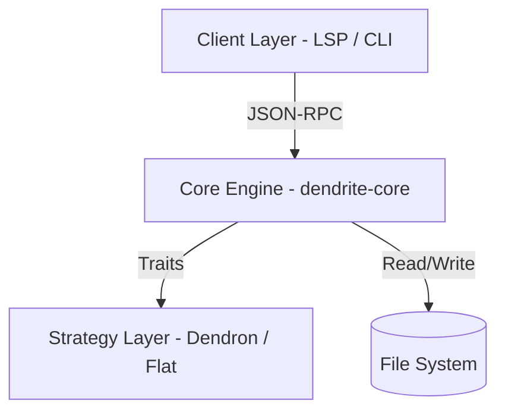

# Dendrite - System Architecture

Dendrite is designed as a headless semantic engine that powers various knowledge-management clients.

## 1. High-Level Architecture

Dendrite follows a three-layer architecture pattern:

### 1.1 Client Layer
- **LSP Backend**: Implements the Language Server Protocol.
- **VS Code Extension**: Provides the UI, Tree Views, and editing assistance.
- **Document Cache**: Manages "dirty" buffers (unsaved changes) to provide real-time feedback.

### 1.2 Core Engine (`dendrite-core`)
- **Workspace Manager**: Orchestrates file scanning, parsing, and indexing.
- **Store**: An in-memory graph database storing notes, links, and backlinks.
- **Identity Registry**: Ensures note IDs remain stable across renames.

### 1.3 Strategy Layer
- **Trait-Based**: Business logic for hierarchy and ID resolution is abstracted behind traits.
- **Dendron Strategy**: Implements dot-separated hierarchies (`foo.bar.md`).

---

## 2. Communication Protocol

Dendrite communicates via **JSON-RPC 2.0**, primarily following the **LSP** specification but extending it for knowledge-specific features.

### 2.1 Standard LSP Methods
- `textDocument/definition`: Jump to note or anchor.
- `textDocument/completion`: WikiLink and block ID autocompletion.
- `workspace/didChangeWatchedFiles`: Automatic re-indexing on disk changes.

### 2.2 Custom Extensions
- `dendrite/getHierarchy`: Returns the full hierarchical tree structure (including Ghost nodes).
- `dendrite/listNotes`: Flat list of all managed notes.

---

## 3. API Contract

The Engine provides several distinct API surfaces:
- **Query API**: Read-only access to notes, links, and graph relationships.
- **Refactor API**: Generates **Edit Plans** (Atomic, previewable file changes).
- **Introspection API**: Provides indexing status and engine capabilities.

> [!IMPORTANT]
> The Engine **never** directly edits files during refactoring. It provides an `EditPlan` which the Client interprets and applies.
